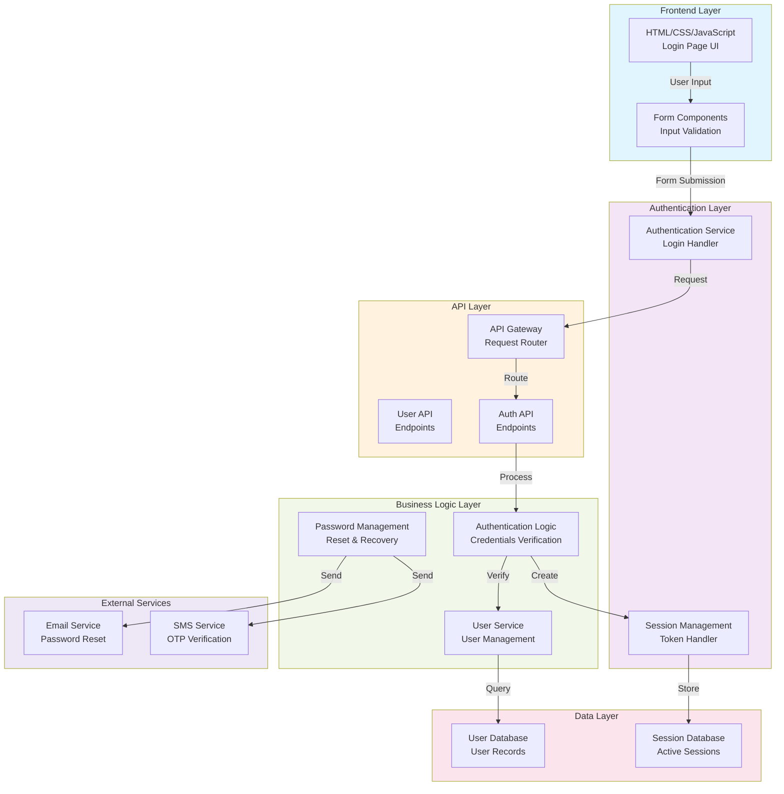

# Bondhubook - Architecture Overview

## System Architecture

## Component Description

### Frontend Layer
- **HTML/CSS/JavaScript**: Provides the user interface with login form
- **Form Components**: Handles input validation and user interactions

### Authentication Layer
- **Authentication Service**: Manages login requests and authentication flow
- **Session Management**: Creates and manages user sessions and tokens

### API Layer
- **API Gateway**: Routes incoming requests to appropriate endpoints
- **User API**: Manages user-related endpoints
- **Auth API**: Handles authentication endpoints

### Business Logic Layer
- **User Service**: Manages user data and user-related operations
- **Authentication Logic**: Verifies credentials against stored user data
- **Password Management**: Handles password reset and recovery

### Data Layer
- **User Database**: Stores user account information
- **Session Database**: Stores active user sessions

### External Services
- **Email Service**: Sends password reset emails
- **SMS Service**: Provides OTP verification for additional security

## Data Flow

1. User enters credentials in the login form
2. Frontend validates input and sends request to Authentication Service
3. AuthService routes request through API Gateway to Auth API
4. Auth API processes the request through Authentication Logic
5. AuthLogic verifies credentials against User Database
6. On successful verification, SessionMgmt creates a session token
7. Session is stored in Session Database
8. User is redirected to the dashboard

## Technology Stack (Based on Current Implementation)

- **Frontend**: HTML5, CSS3, Vanilla JavaScript
- **Backend**: (To be implemented)
- **Database**: (To be implemented)
- **Authentication**: JWT/Session-based (To be implemented)